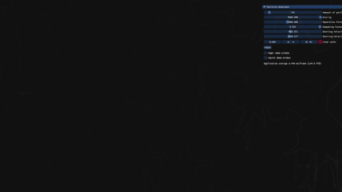

# Particle Simulation

A simple particle simulator which implements a Neighbor Searching algorithm
using a Grid system and Spatial Hashing


## Demo



## Build
- To build just clone the repo and run:

```sh
./build.sh
```

## TODO:
- [x] ~~Implement Neighbor Searching with Spatial Hashing~~
- [ ] Changing colors depending on particle speed
- [ ] Fix the dampening factor
- [ ] Make the menu look better
- [ ] Mouse click particle creation feature


[Buy me a coffee!](https://buymeacoffee.com/alexmtavares?new=1)
